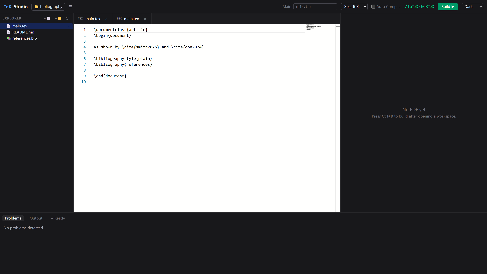

# LaTeX Studio

A lightweight **local-first** LaTeX workspace: open a local `.tex` project in your browser, edit it with Monaco, compile with your local TeX distribution (XeLaTeX / pdfLaTeX / LuaLaTeX / latexmk), preview the PDF live, and jump between source and PDF.

> Local-first + Web UI + **LaTeX IDE** + PDF Preview — no cloud, no accounts, fully offline.



## Features

- **Workspace** — open any local folder as a LaTeX project; file tree with create / rename / delete / refresh; automatic main-file detection (`main.tex`, then any file containing `\documentclass`); manual override in the toolbar.
- **Editor** — Monaco Editor with a custom LaTeX language (syntax highlighting, bracket matching, folding, minimap, search & replace).
- **Project Index** *(V0.2)* — one incremental scanner builds a live index of sections, labels, references, citations, figures, tables, equations, packages and the `\input`/`\include` graph; editor buffers are re-indexed debounced without touching disk.
- **Outline & Navigator** *(V0.2)* — sidebar tabs: clickable section tree with compiled numbering, plus a whole-project navigator (figures / tables / equations / citations / labels) — every node jumps to source.
- **Reference & Citation Intelligence** *(V0.2)* — undefined references, duplicate labels and undefined citations appear live in Problems (no build needed); hover cards for cite keys (author/title/year) and label targets.
- **IntelliSense** *(V0.2)* — index-driven completions for `\cite`, `\ref`, `\includegraphics`; package-aware environments; `\usepackage` / `\documentclass` catalogs.
- **Multi-file** — tabs, dirty-state markers (`main.tex *`), `Ctrl+S` save.
- **Compile** — latexmk or direct engines via an isolated CompilerService; single-flight build queue (new builds cancel the running one), timeout, output isolated to `.build/`; automatic BibTeX/Biber passes based on the project's own directives.
- **PDF Preview** — PDF.js continuous scroll, zoom / fit-width / fit-page, page navigation, text search with match highlighting and next/previous (`Enter` / `Shift+Enter`), rotate, download, fullscreen.
- **SyncTeX bidirectional** *(V0.2)* — `Ctrl+Click` in the source jumps to the PDF page; `Ctrl+Click` in the PDF maps back to the exact source line (graceful no-op when `synctex` is unavailable).
- **Problems** — LaTeX log parsing into errors / warnings / info (`Undefined control sequence`, `Missing $`, file not found, undefined citations/references, overfull boxes) merged with live index diagnostics; click-to-jump to source.
- **Image Preview** *(V0.2)* — png / jpg / gif / svg / pdf open an inline viewer tab (zoom / fit / rotate).
- **Auto Compile** — debounced rebuild 1 s after each save.
- **Command Palette** — `Ctrl+Shift+P`: Build, Save, Open Workspace, Change Compiler, Reload Tree, Theme…
- **Themes** — dark (default) / light / system. Session state persists across reloads.

## Architecture

```text
┌───────────────────────────────── Browser ─────────────────────────────────┐
│ React + Zustand stores (workspace/editor/build/index/preview/ui)          │
│ Sidebar (Explorer·Outline·Navigator) │ Monaco │ PDF.js Preview │ Problems │
└───────────────────────────────────┬───────────────────────────────────────┘
                                    │ HTTP JSON API only (instance-token auth)
┌───────────────────────────────────▼────────────────────────────────────────┐
│ Fastify server                                                             │
│  routes: workspace · files(+raw) · index · build · synctex(fwd/inv) · env  │
│  services: WorkspaceService · CompilerService · ProjectIndexService        │
│  security: safeResolve() jail · Host allow-list · instance token           │
└───────────────┬─────────────────────────────┬─────────────────────────────┘
                ▼                             ▼
         Local filesystem              latexmk / xelatex / synctex …
                                        (spawn, shell:false)

Project flow (V0.2):
  LaTeX project ──▶ ProjectIndex ──▶ Outline / Navigator / IntelliSense
                         │                    │
                    diagnostics ─────────▶ Problems panel
```

Monorepo layout:

```text
apps/
  web/                 React + Vite + Tailwind UI
  server/              Fastify API + compiler/workspace/index services
packages/
  shared/              shared TypeScript types
  latex-parser/        LaTeX parsers (structure/labels/refs/citations/packages/
                       includes/environments) + project-index builder + log parser
tests/
  fixtures/            basic · chinese · multi-file(+bib) · bibliography(-biber)
                       image · unicode-path · error projects
  e2e/                 Playwright specs (app loop · build loop · IDE intelligence)
```

Key principle: the frontend never touches the filesystem or spawns processes — everything goes through the API, compilation lives behind a `CompilerService`, and all paths are jailed to the open workspace via `safeResolve()`.

## Release Verification

### 1. Install a TeX distribution

- Windows: [MiKTeX](https://miktex.org) or [TeX Live](https://tug.org/texlive). latexmk additionally needs Perl ([Strawberry Perl](https://strawberryperl.com)) on Windows.
- macOS/Linux: TeX Live.

### 2. Verify the tools in a NEW terminal

```bash
xelatex --version
latexmk --version
```

### 3. Doctor

```bash
pnpm doctor          # human-readable, exit 0 = READY / exit 1 = NOT READY
pnpm doctor --json   # machine-readable for CI
```

### 4. Full release check (cross-platform, sets all env vars itself)

```bash
pnpm release:check
```

Equivalent to running: `doctor → typecheck → unit/integration tests → RUN_LATEX_TESTS=1 real-LaTeX tests → E2E_HAS_LATEX=1 real-build E2E → web+server builds`.

Individual real-LaTeX steps:

```bash
pnpm test:latex       # real compilation fixtures incl. stale-PDF regression
pnpm test:e2e:latex   # real-build Playwright suite
```

### 5. Expected output

```text
Doctor               PASS
Typecheck            PASS
Unit/Integration     PASS
Real LaTeX           PASS
Real E2E             PASS
Web Build            PASS
Server Build         PASS

RESULT:
READY FOR v<version>
```

(The verdict line is generated from the root `package.json` version.)

Rules of the gate: without `RUN_LATEX_TESTS=1` real-compilation tests SKIP quietly (normal dev); **with** it, a missing TeX environment is a hard `BLOCKED` failure — a skip can never masquerade as a pass. Real build assertions check true artifacts: PDF exists, size > 0, header `%PDF-`, and a failed rebuild serves no PDF.

## Security

The server binds to `127.0.0.1` only and protects its API against localhost CSRF / DNS-rebinding:

- **CORS** never reflects foreign origins (only same-origin + the Vite dev server may read responses).
- **Host allow-list** rejects DNS-rebinding requests (Host must be `localhost` / `127.0.0.1` / `[::1]` / this machine's hostname).
- **Instance token** — every browser page load receives an `HttpOnly SameSite=Strict` session cookie; all `/api/*` calls require it (or the `x-latex-studio-token` header). Automated tests run with `NODE_ENV=test`, which opts out of this layer.

Error shape: `{ "error": { "code", "message" } }` with codes including `UNAUTHORIZED` (401) / `FORBIDDEN` (403).

## Requirements

- Node.js ≥ 20 and pnpm ≥ 9
- A LaTeX distribution for compiling: MiKTeX or TeX Live (latexmk needs Perl on Windows)

The app runs fine without LaTeX (browse/edit), but building needs at least one engine on your `PATH`.

## Installation & Run

```bash
pnpm install

# development (hot reload)
pnpm dev              # → http://localhost:5173

# production
pnpm build
pnpm start            # → http://localhost:3210
```

Then: **Open Workspace** → pick a folder containing `.tex` files → edit → `Ctrl+S` → `Ctrl+B`.

## LaTeX Environment

The header badge shows detection results for `latexmk`, `xelatex`, `pdflatex`, `lualatex`, `bibtex`, `biber`, `synctex` — hover to see resolved absolute paths and versions. Detection order:

1. `PATH` lookup (`where` / `which`)
2. Common install locations (TeX Live / MiKTeX dirs per platform)
3. Extra user-configured directories: `LATEX_STUDIO_EXTRA_PATH` env var or `~/.latex-studio.json` `{ "extraPaths": [...] }`

Diagnose any time:

```bash
pnpm doctor           # READY / NOT READY report
```

## Windows Setup

- Verify in a **new** terminal: `xelatex --version` && `latexmk --version`
- If `latexmk` is missing choose `XeLaTeX`/`Auto` — the server runs engines directly and drives BibTeX/Biber itself.
- Spaces, CJK characters and drive letters in paths are supported (`spawn(shell:false)`, no shell concatenation).
- Cancel kills the whole process tree (`taskkill /T /F`).

## Testing

```bash
pnpm test             # unit + integration (no LaTeX required)
pnpm test:latex       # real compilation tests (needs TeX Live / MiKTeX)
pnpm test:e2e         # Playwright suite
pnpm release:check    # the full gate
```

- `packages/latex-parser` — log parsing (undefined control sequence, missing `$`, file-not-found, citation/reference warnings, overfull/underfull, package errors, nested-file attribution); project parsers (structure/labels/references/citations/packages/includes/environments), bib entry fields, cross-file index assembly with diagnostics.
- `apps/server` — workspace CRUD + `/api/file/raw` routes, main-file detection, path-traversal security, process manager, build concurrency, project-index endpoints (incremental refresh, buffer updates, jail checks).
- `tests/e2e` — specs `01`–`12`: load → open → edit → save → build → PDF → problems → outline/navigator → SyncTeX loop → tabs → workspace switch. Build-dependent specs skip loudly unless `E2E_HAS_LATEX=1`. Real build assertions verify `%PDF-` artifacts on disk.

## Error codes

All API errors are structured — the frontend never string-matches:

```json
{ "error": { "code": "COMPILER_NOT_FOUND", "message": "…" } }
```

Codes: `WORKSPACE_NOT_FOUND` · `WORKSPACE_NOT_OPEN` · `FILE_NOT_FOUND` · `PATH_FORBIDDEN` · `FORBIDDEN` · `UNAUTHORIZED` · `INVALID_FILE` · `INVALID_ARGUMENT` · `COMPILER_NOT_FOUND` · `BUILD_FAILED` · `BUILD_TIMEOUT` · `BUILD_CANCELLED` · `CONFLICT` · `INTERNAL_ERROR`

Build lifecycle states surfaced in the UI: `Ready → Building… → Build successful / Build failed / Cancelled / Timed out / No LaTeX compiler found`, plus notices such as *latexmk unavailable — using direct compiler mode*.

## Troubleshooting

| Symptom | Fix |
| --- | --- |
| “No LaTeX environment detected” | Install MiKTeX/TeX Live, reopen terminal so `PATH` updates, restart the server. |
| Build fails with `spawn … ENOENT` | The chosen compiler isn't installed — switch compiler in the toolbar. |
| Chinese document shows blank glyphs | Use `ctexart`/`ctexbook` with XeLaTeX (the default). |
| Port 3210 busy | Set `PORT=<n>` env var before `pnpm start`. |
| SyncTeX jump does nothing | `synctex` CLI missing or the build predates `-synctex=1` output — rebuild once. |

## Known limitations (V0.2.x — final)

- PDF search highlights matches per text-item (with cross-item joining); a match broken by hyphenation across a line end may still be missed.
- Single workspace at a time; single user by design.
- The project index lives in memory for the server session — it rebuilds in well under a second on open, so no on-disk cache is persisted.
- Spell/grammar checking is not provided.

## Roadmap

- ~~V0.1 — Local LaTeX Foundation~~ ✅
- ~~V0.1.x — Security / Hardening~~ ✅ (instance-token auth · CSRF/DNS-rebinding guards · path-leak fixes)
- ~~V0.2.0 — LaTeX IDE Intelligence~~ ✅ (Project Index · Outline · Navigator · IntelliSense 2.0 · SyncTeX bidirectional) — [plan](docs/V0.2-PLAN.md)
- ~~V0.2.1/0.2.2 — Real-world Hardening & Audit Cleanup~~ ✅
- **V0.2.3 — Compatibility Final** ← current: real-paper matrix closed out (BibLaTeX+biber · IEEEtran · ctexbook chapter thesis · Beamer · large PDF · 240-chapter index perf · queue & AutoBuild stability · SyncTeX repeat-loop). **V0.2.x is now frozen.**
- **V0.3 — Research Workspace Intelligence** — [plan](docs/V0.3-PLAN.md): Project Graph (include+reference+citation edges), File Watcher (source/build roots separated; symlink/junction safety first-class), Inspectors (figure/table/citation/reference with usage stats), Project Diagnostics ("Research Health"), rule-based academic-writing checks, template packages. Persistent disk cache deferred to V0.3.1 until watcher→increment→graph proves stable. Recent-projects list ships before any multi-workspace work.
- **V0.4 — AI-native LaTeX** — project-aware agent (error-fix / rewrite / explain / generate / refactor) standing on the Project Graph
- **V0.5 — Engineering**: Git integration, snapshots, diff, version history
- Beyond: remote compiler, cloud workspace, collaboration

Release policy: patches are cut promptly so `master` always matches the latest tag.
